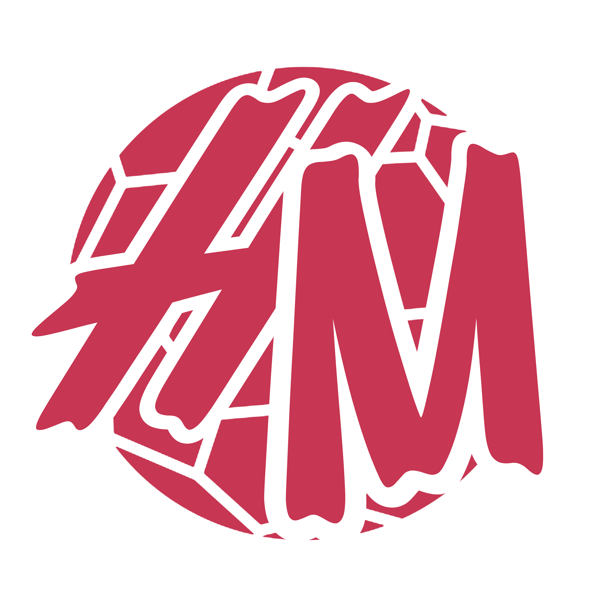
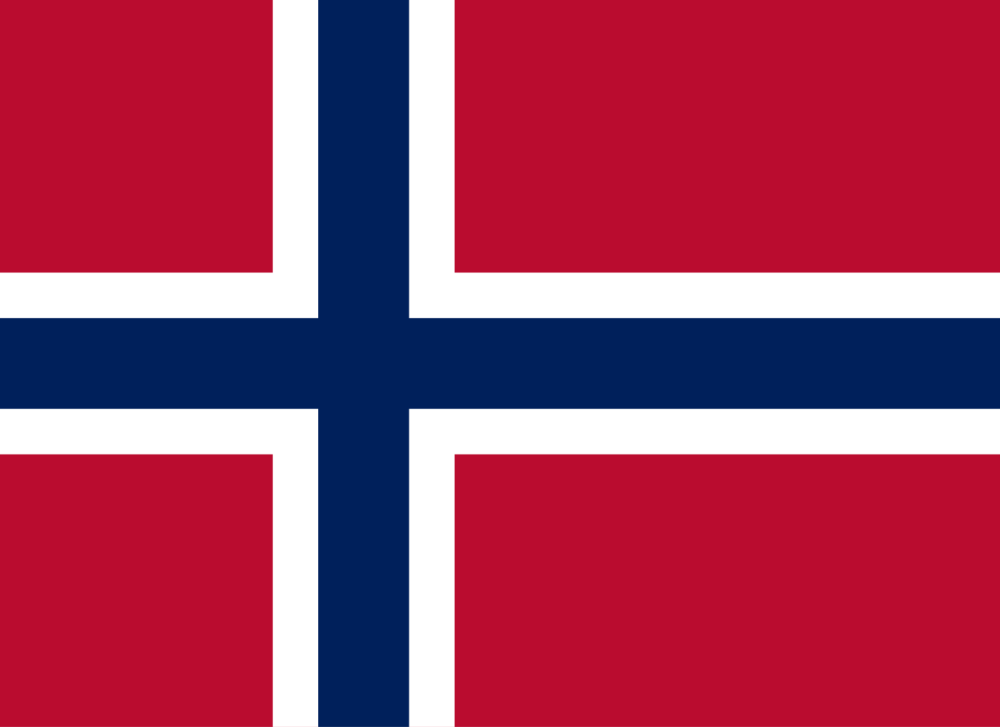
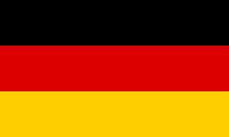
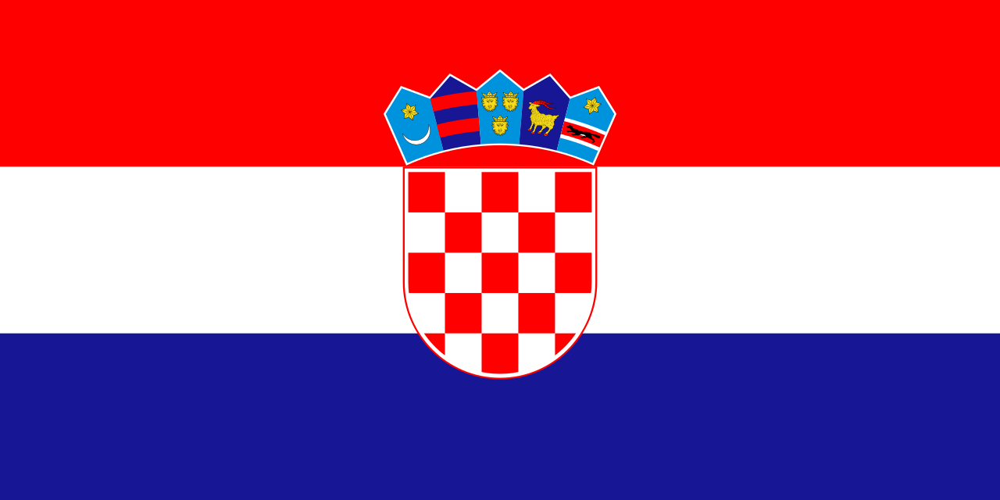

# Handball Manager 

## About the Game

Handball Manager is an immersive simulation game that puts you in charge of your own handball club. Manage your team's finances, lead them through a competitive league season, and develop your players from promising youths into world-class athletes.

## Features

* **In-Depth Team Management:** Take control of your team's roster, manage player contracts, and balance your club's budget, including wages and transfer funds.
* **Dynamic Player Progression:** Witness your players evolve over time. Their skills will improve or decline based on their age, performance in matches, and training.
* **Realistic Transfer Market:** Engage in a dynamic transfer market where you can buy and sell players to strengthen your squad.
* **Youth Development:** Invest in the future with a comprehensive youth intake system. Unearth hidden gems and nurture them into the next generation of handball stars.
* **Authentic Match Simulation:** Experience the thrill of match day with a statistically-based simulation engine.
* **Competitive League System:** Compete in a full league structure, track your progress on the league table, and strive to become the champion.
* **Strategic Scouting:** Send your scouts to discover new talent and gain a competitive edge in the transfer market.

## Current In-game Competitions

*  **Romania Women's Handball League (Liga Florilor)**
*  **Romania Women's Handball Cup (Cupa Romaniei)**
*  **Romania Women's Handball Supercup (Supercupa Romaniei)**
*  **Hungary Women's Handball League (NB I)**
*  **Hungary Women's Handball Cup (Magyar Kupa)**
*  **France Women's Handball League (Ligue Butagaz Energie)**
*  **France Women's Handball Cup (Coupe de France)**

## Upcoming Competitions

*  **Denmark Women's Handball League (Kvindeligaen)**
*  **Denmark Women's Handball Cup (Landspokalturnering)**
*  **Denmark Women's Handball SuperCup**
*  **Norway Women's Handball League (REMA 1000-ligaen, Women)**
*  **Norway Women's Handball Cup**
*  **Germany Women's Handball League (Women Bundesliga)**
*  **Germany Women's Handball Cup (DHB Pokal Women)**
*  **Germany Women's Handball SuperCup (SuperCup Women)**
*  **Croatia Women's Handball League (1. HRL Women)**
*  **Croatia Women's Handball Cup (Croatian Cup)**

## Recently added Features

* **Detailed information tab for each club (trophies, description, squad integration etc.)**
* **----- 29.03.2026 MAJOR UPDATE -----**
* **Managers & Manager Creation**
* **Dynamic Stadium Attendance (based on club form, competition, game importance)** 
* **Updated Club Info UI**
* **Personal Manager "Profile" Tab**
* **Neutral venue logic for Cup and Supercup Final4's**
* **----- 12.04.2026 APRIL UPDATE -----**
* **Squad selection before games**
* **In-depth match simulation (time-outs, substitutions etc.)**
* **UI Improvements**
* **----- 29.04.2026 Late April Update -----**
* **Hungary Women's Handball League (NB I) added**
* **Hungary Women's Handball Cup (Magyar Kupa) added**
* **----- 03.05.2026 Early May Competitions Update -----**
* **France Women's Handball League (Ligue Butagaz Energie)**
* **France Women's Handball Cup (Coupe de France)**
* **Added realistic budgets to all clubs**

## Upcoming Features

* **Club facilities**
* **Even MORE competitions**
* **Competitions prize money**
* **Sponsors**

## 📜 License & Copyright

**© 2026 Vieru-Potecu Cezar-Mihai. All rights reserved.**

This project is currently **Source-Available**. While the repository is public for community feedback and portfolio display, the following conditions apply:

* **No Redistribution:** You may not redistribute, sub-license, copy, or sell this source code or any binaries derived from it.
* **No Commercial Use:** This code and its assets may not be used in any commercial projects or products. 
* **Reservation of Rights:** The author reserves all rights to the underlying logic, match engine, and branding in preparation for a commercial release (e.g., via Steam).

Use of this code for educational study is permitted, but any other use requires explicit written permission from the author.

## ⚠️ Disclaimer

Handball Manager is a fan-made simulation project. It is **not affiliated with, endorsed by, or connected to**:
* The Romanian Handball Federation (FRH) or Liga Florilor.
* The Hungarian Handball Federation (MKSZ) or the K&H Női Liga.
* The French Handball Federation (FFH) or the Ligue Butagaz Energie.
* Any other official handball organizations, leagues, teams, or professional players.
