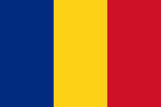
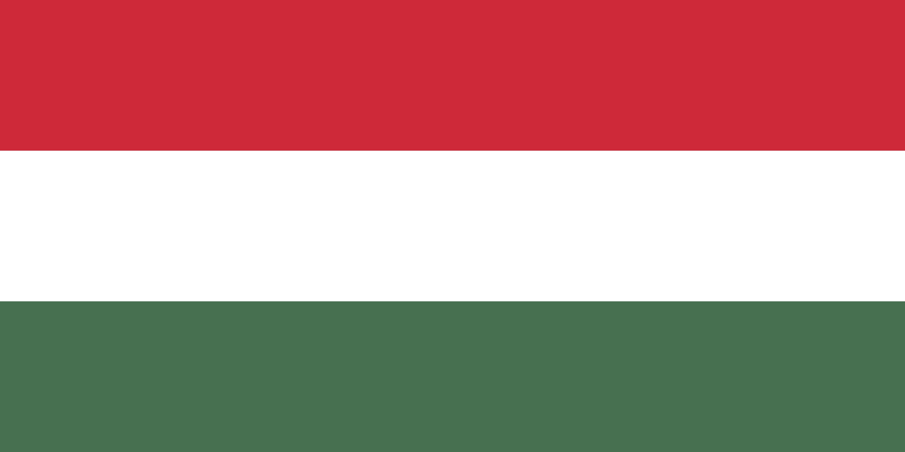
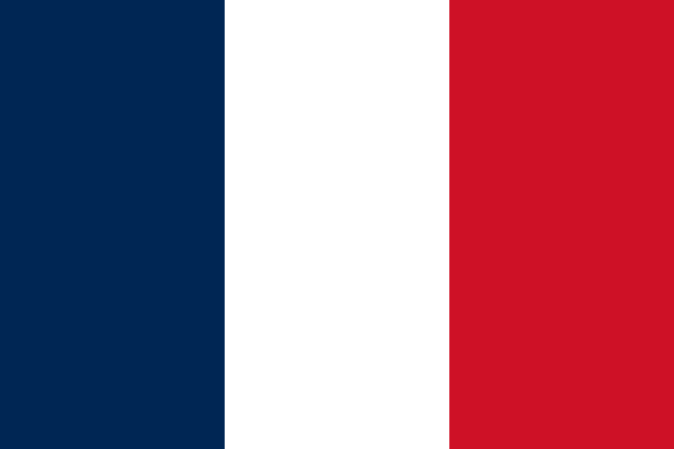
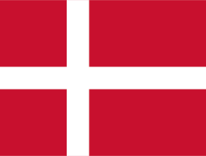

# Handball Manager

## About the Game

Handball Manager is an immersive simulation game that puts you in charge of your own handball club. Manage your team's finances, lead them through a competitive league season, and develop your players from promising youths into world-class athletes.

## Features

*   **In-Depth Team Management:** Take control of your team's roster, manage player contracts, and balance your club's budget, including wages and transfer funds.
*   **Dynamic Player Progression:** Witness your players evolve over time. Their skills will improve or decline based on their age, performance in matches, and training.
*   **Realistic Transfer Market:** Engage in a dynamic transfer market where you can buy and sell players to strengthen your squad.
*   **Youth Development:** Invest in the future with a comprehensive youth intake system. Unearth hidden gems and nurture them into the next generation of handball stars.
*   **Authentic Match Simulation:** Experience the thrill of match day with a statistically-based simulation engine.
*   **Competitive League System:** Compete in a full league structure, track your progress on the league table, and strive to become the champion.
*   **Strategic Scouting:** Send your scouts to discover new talent and gain a competitive edge in the transfer market.

## Current In-game Competitions

*    **Romania Women's Handball League (Liga Florilor)**
*    **Romania Women's Handball Cup (Cupa Romaniei)**
*    **Romania Women's Handball Supercup (Supercupa Romaniei)**
*    **Hungary Women's Handball League (NB I)**
*    **Hungary Women's Handball Cup (Magyar Kupa)**

## Upcoming Competitions

*    **France Women's Handball League (LFH Division 1)**
*    **France Women's Handball Cup (Coupe de France)**
*    **Denmark Women's Handball League (Kvindeligaen)**
*    **Denmark Women's Handball Cup**
*    **Denmark Women's Handball SuperCup**

## Recently added Features

*   **Detailed information tab for each club (trophies, description, squad integration etc.)**
*   **----- 29.03.2026 MAJOR UPDATE -----**
*   **Managers** 
*   **Manager Creation**
*   **Dynamic Stadium Attendance (based on club form, competition, game importance)** 
*   **Updated Club Info UI**
*   **Personal Manager "Profile" Tab**
*   **Neutral venue logic for Cup and Supercup Final4's**
*   **----- 12.04.2026 APRIL UPDATE -----**
*   **Squad selection before games**
*   **In-depth match simulation (time-outs, substitutions etc.)**
*   **UI Improvements**
*   **----- 29.04.2026 Late April Update -----**
*   **Hungary Women's Handball League (NB I) added**
*   **Hungary Women's Handball Cup (Magyar Kupa) added**

## Upcoming Features

*   **Club facilities**
*   **More competitions**
*   **Competitions prize money**
*   **Sponsors**

## Copyright

© 2026 Vieru-Potecu Cezar-Mihai. All rights reserved.

## Disclaimer

This game is not affiliated with, endorsed by, or connected to the Romanian Women's Handball League, the Romanian Handball Federation, or any official handball organizations, teams, leagues, or players.