# Handball Manager 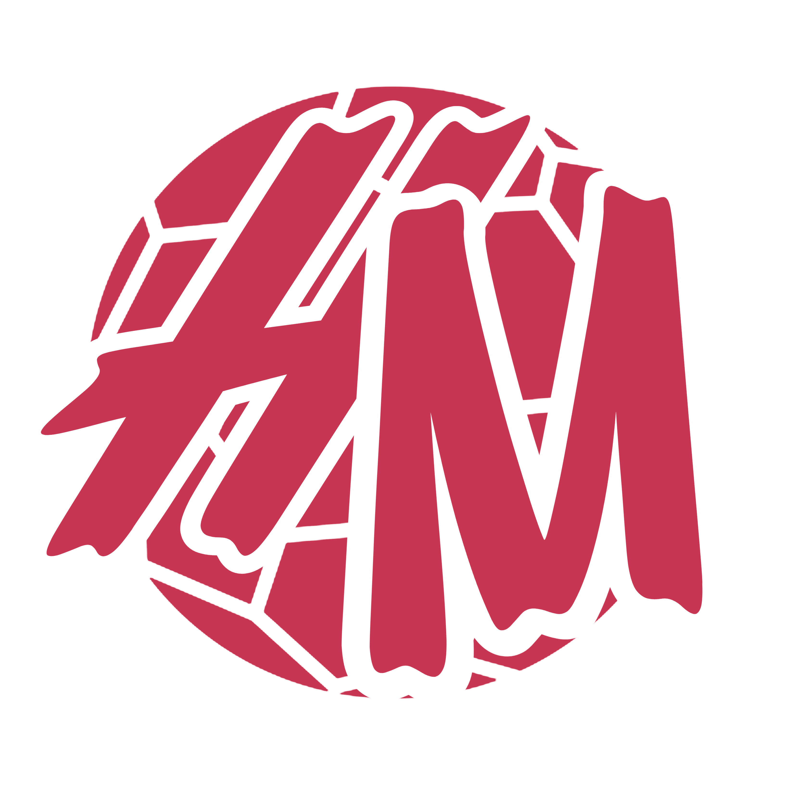

## About the Game

Handball Manager is an immersive simulation game that puts you in charge of your own handball club. Manage your team's finances, lead them through a competitive league season, and develop your players from promising youths into world-class athletes.

## Features

* **In-Depth Team Management:** Take control of your team's roster, manage player contracts, and balance your club's budget, including wages and transfer funds.
* **Dynamic Player Progression:** Witness your players evolve over time. Their skills will improve or decline based on their age, performance in matches, and training.
* **Realistic Transfer Market:** Engage in a dynamic transfer market where you can buy and sell players to strengthen your squad.
* **Youth Development:** Invest in the future with a comprehensive youth intake system. Unearth hidden gems and nurture them into the next generation of handball stars.
* **Authentic Match Simulation:** Experience the thrill of match day with a statistically-based simulation engine.
* **Competitive League System:** Compete in a full league structure, track your progress on the league table, and strive to become the champion.
* **Strategic Scouting:** Send your scouts to discover new talent and gain a competitive edge in the transfer market.

## Get the Game

* **Android:** grab the latest APK from the [Releases](../../releases) page, or join the Google Play open testing programme (by looking up the game on the Play Store).
* **Windows:** grab the latest build from the [Releases](../../releases) page. (behind compared to the Android version)

> This repository hosts downloadable builds and project information only — the full source is maintained in a private repository. See [License & Copyright](#-license--copyright) below.

## Current In-game Competitions

* 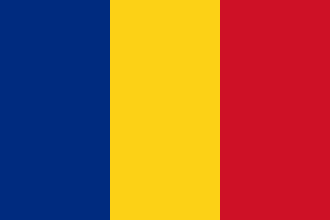 **Romania Women's Handball League (Liga Florilor)**
*  **Romania Women's Handball Cup (Cupa Romaniei)**
*  **Romania Women's Handball Supercup (Supercupa Romaniei)**
* 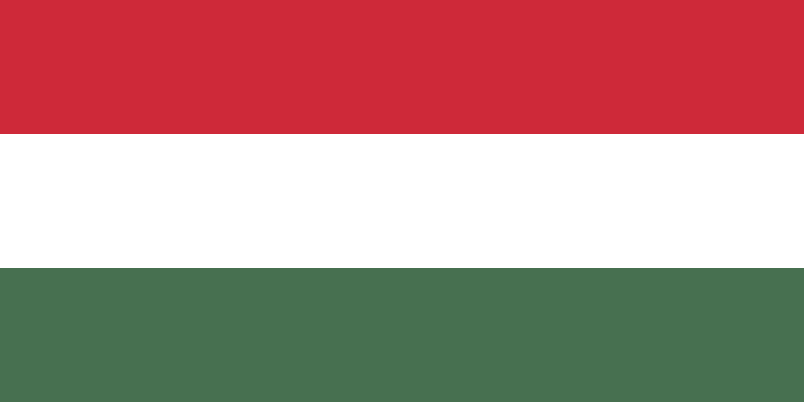 **Hungary Women's Handball League (NB I)**
*  **Hungary Women's Handball Cup (Magyar Kupa)**
* 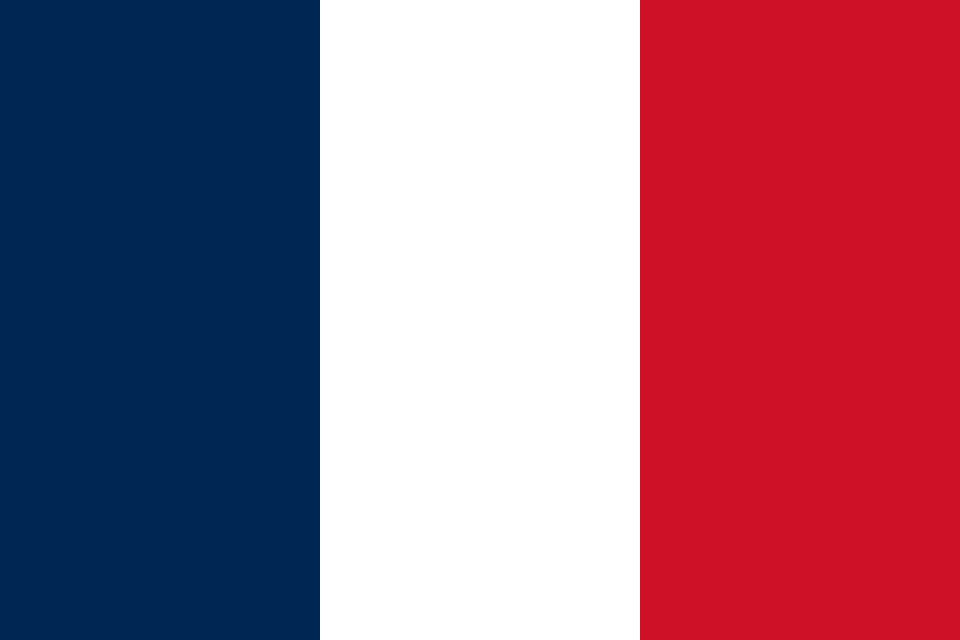 **France Women's Handball League (Ligue Butagaz Energie)**
*  **France Women's Handball Cup (Coupe de France)**
* 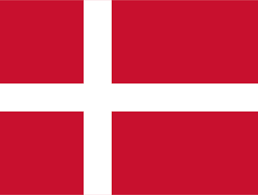 **Denmark Women's Handball League (Kvindeligaen)**
*  **Denmark Women's Handball Cup (Landspokalturnering)**
*  **Denmark Women's Handball SuperCup**
* 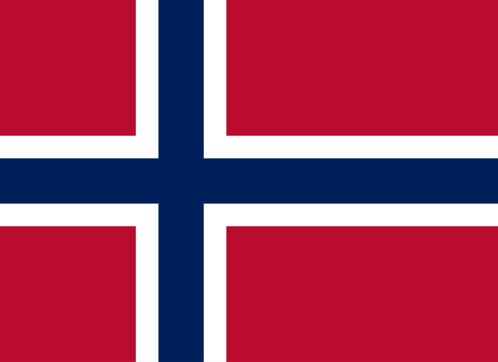 **Norway Women's Handball League (REMA 1000-ligaen)**
*  **Norway Women's Handball Cup (Norgesmesterskapet)**
* 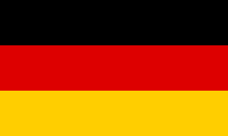 **Germany Women's Handball League (1. Bundesliga Frauen)**
*  **Germany Women's Handball Cup (DHB-Pokal)**
*  **Germany Women's Handball SuperCup (DHB Supercup)**
* 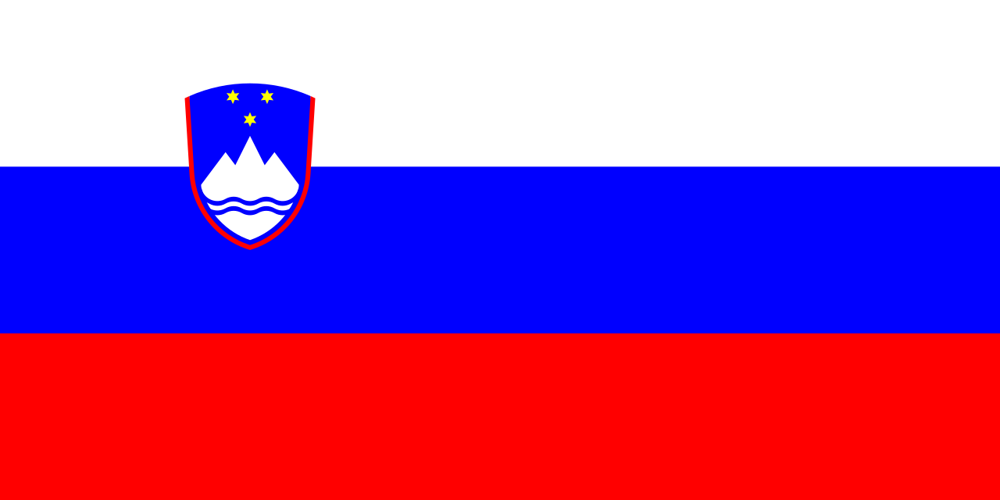 **Slovenia Women's Handball League (1. SRL ženske)**
*  **Slovenia Women's Handball Cup (Pokal Slovenije)**
* 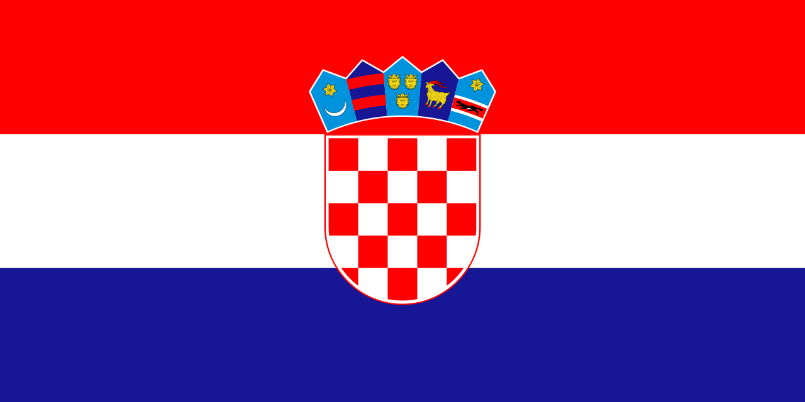 **Croatia Women's Handball League (1. HRL Žene)**
*  **Croatia Women's Handball Cup (Hrvatski kup)**
* 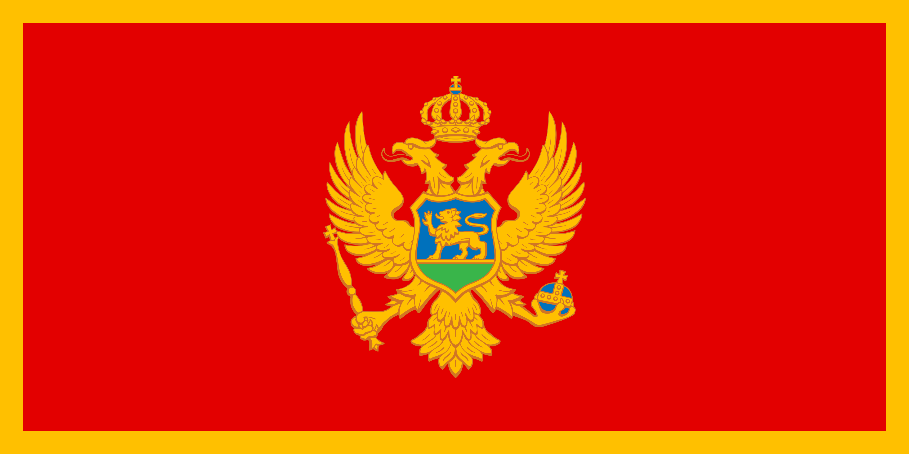 **Montenegro Women's Handball League (Prva liga)**
*  **Montenegro Women's Handball Cup (Kup Crne Gore)**
* 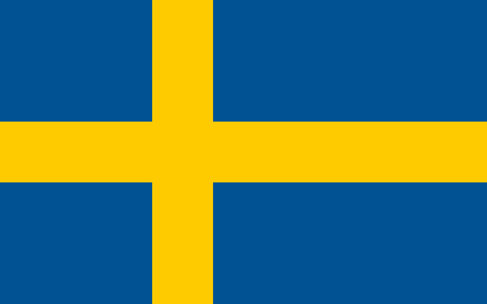 **Sweden Women's Handball League (Handbollsligan)**
*  **Sweden Women's Handball Cup (Svenska Cupen)**
* 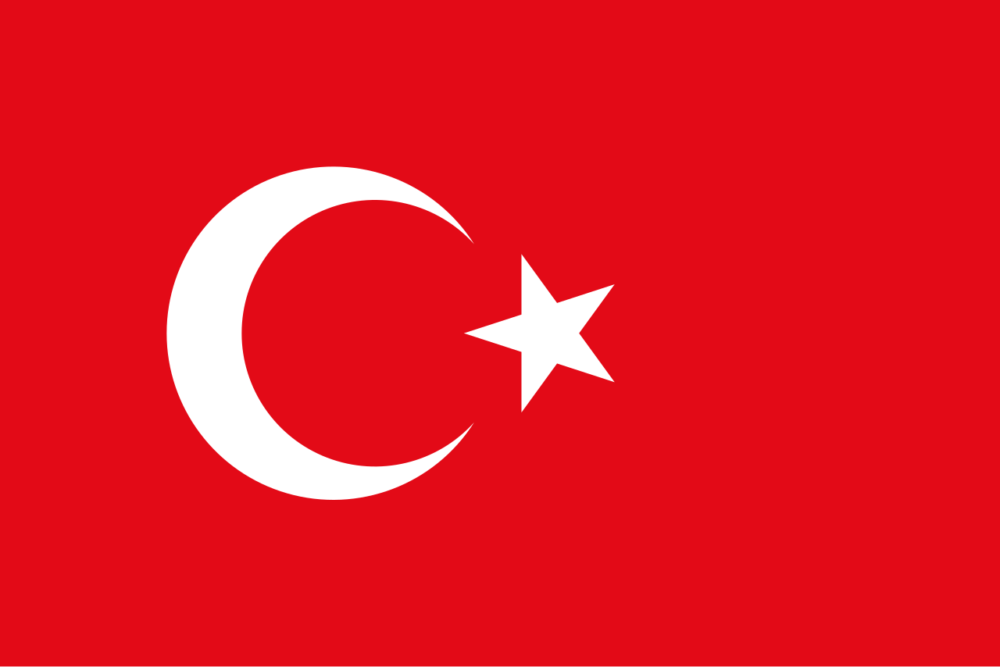 **Türkiye Women's Handball League (Kadınlar Süper Lig)**
*  **Türkiye Women's Handball Cup (Kadınlar Kupası)**
*  **Türkiye Women's Handball SuperCup (Kadınlar Süper Kupa)**
* 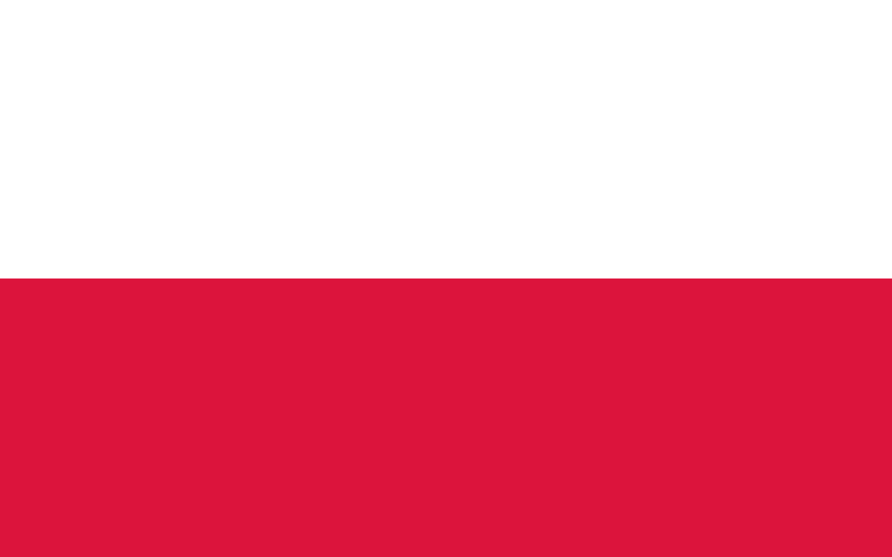 **Poland Women's Handball League (ORLEN Superliga Kobiet)**
*  **Poland Women's Handball Cup (Puchar Polski)**
*  **Poland Women's Handball SuperCup (Superpuchar Polski)**

## Upcoming Competitions

* 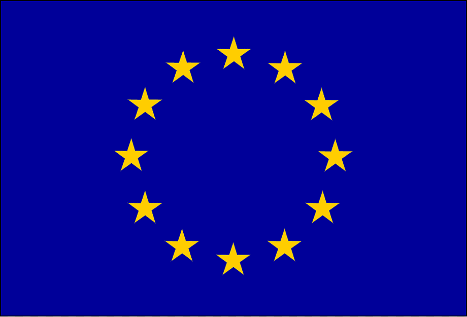 **EHF Women's Champions League**
*  **EHF Women's European League**

## Recently added Features

* **----- 29.03.2026 MAJOR UPDATE -----**
* **Managers & Manager Creation**
* **Dynamic Stadium Attendance (based on club form, competition, game importance)** 
* **Updated Club Info UI**
* **Personal Manager "Profile" Tab**
* **Neutral venue logic for Cup and Supercup Final4's**
* **----- 12.04.2026 APRIL UPDATE -----**
* **Squad selection before games**
* **In-depth match simulation (time-outs, substitutions etc.)**
* **UI Improvements**
* **----- 29.04.2026 Late April Update -----**
* **Hungary competitions added (League & Cup)**
* **----- 03.05.2026 Early May Competitions Update -----**
* **France competitions added (League & Cup)**
* **Added realistic budgets to all clubs**
* **----- 10.05.2026 May Competitions Update -----**
* **Denmark competitions added (League, Cup & SuperCup)**
* **----- 08.07.2026 July Update -----**
* **Club facilities added - Training and Youth**
* **Competitions now award prize money depending on position / trophies won**
* **Save/Load game**
* **Bug fixes**
* **----- 12.07.2026 JULY MOBILE PORT!!! -----**
* **FULL and complete mobile port - soon to be posted to Google PlayStore!**
* **----- 26.07.2026 Norway Update -----**
* **Norway competitions added (League & Cup)**
* **Dedicated play-off tab for the Norwegian league**
* **Nationality flags in squad and player views**
* **Attributes highlighted by player position**
* **Bug fixes (missing Positioning attribute, drawn cup knockout ties)**
* **----- 28.07.2026 Germany Update -----**
* **Germany competitions added (League, Cup & SuperCup)**
* **Supercup winners now earn prize money**
* **German and Norwegian youth intakes now produce German and Norwegian names**
* **----- 04.08.2026 4 NEW COUNTRIES Update -----**
* **Slovenia competitions added (League & Cup)**
* **Croatia competitions added (League & Cup)**
* **Montenegro competitions added (League & Cup)**
* **Sweden competitions added (League & Cup) — the tenth country**
* **Youth name pools doubled to 40 first names and 40 surnames for every country**
* **Ticket sales now earn money. Attendance was simulated but never paid out**
* **Finances tab: gate receipts, wages and a season summary by category**
* **Fixed: cup finals could be scheduled on the same day as a league round**
* **Fixed: a new Slovenian season started with the previous season's split points still on the table (existing saves repair themselves)**
* **Every league now archives a full 1st / 2nd / 3rd for seasons you play**
* **Squad numbers can be handed out by hand from a player's profile**
* **New signings and youth graduates get a number that suits their position, instead of the lowest one free**
* **----- 10.08.2026 Google Play Open Testing Update! -----**
* **Added Poland and Turkish competitions**

## Upcoming Features / Updates 

* **European competitions & coefficients logic**
* **Sponsors**

## 📜 License & Copyright

**© 2026 Vieru-Potecu Cezar-Mihai. All rights reserved.**

This repository is public for portfolio and community purposes, and to distribute the game itself — the source code is closed and maintained in a private repository. The following conditions apply to the game, its builds, and its assets:

* **No Redistribution:** You may not redistribute, sub-license, or sell the builds made available here.
* **No Commercial Use:** The game and its assets may not be used in any commercial project or product.
* **Reservation of Rights:** The author reserves all rights to the underlying logic, match engine, and branding in preparation for a commercial release (e.g., via Steam).

Downloading and playing the game for personal use is welcome. Any other use requires explicit written permission from the author.

## ⚠️ Disclaimer

Handball Manager is a fan-made simulation project. It is **not affiliated with, endorsed by, or connected to**:
* The Romanian Handball Federation (FRH) or Liga Florilor.
* The Hungarian Handball Federation (MKSZ) or the K&H Női Liga.
* The French Handball Federation (FFH) or the Ligue Butagaz Energie.
* The Danish Handball Federation (DanskHåndbold) or the Kvindeligaen.
* The Norwegian Handball Federation (Norges Handballforbund) or the REMA 1000-ligaen.
* The German Handball Association (DHB) or the 1. Frauen Bundesliga.
* The Slovenian Handball Federation (RZS) or the 1. SRL ženske.
* The Croatian Handball Federation (HRS) or the 1. HRL Žene.
* The Montenegrin Handball Federation (RSCG) or the Prva Liga.
* The Swedish Handball Federation (SHF) or the Handbollsligan.
* The Turkish Handball Federation (THF) or the Kadınlar Süper Lig.
* The Polish Handball Association (ZPRP) or the ORLEN Superliga Kobiet.
* Any other official handball organizations, leagues, teams, or professional players.
